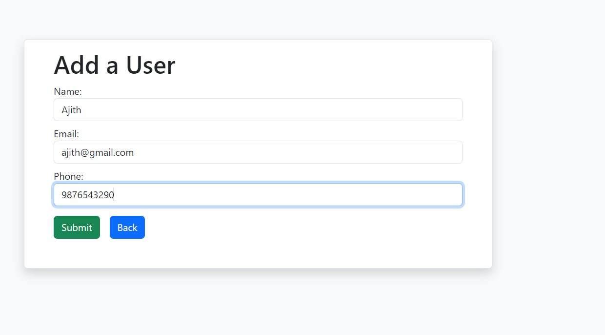

## React Axios Task

## Task Description:

Create a React App that allows for CRUD operations with user data using React and Axios fetch to interact with a mock API.

Mock API URL : https://jsonplaceholder.typicode.com/users

## Requirements:

- Display all the existing API data in UI using Axios.

- Users should be able to perform CRUD operations on user data, including adding, editing, and deleting user records.

- The user data should be stored in a mock API that can be accessed using Axios fetch.

- The UI should have a clean and responsive design that is easy to use and navigate.

Create components such as

- Create.jsx
- Home.jsx
- Read.jsx
- Update.jsx

Create a `db.json` file to store the data

{

 "users": [

    {
      "id": "1",
      "name": "Leanne Graham",
      "username": "Bret",
      "email": "Sincere@april.bizts",
      "phone": "1-770-736-8031 x56442",
      "website": "hildegard.org"
    },

    {
      "id": "2",
      "name": "Ervin Howell",
      "username": "Antonette",
      "email": "Shanna@melissa.tv",
      "phone": "010-692-6593 x09125",
      "website": "anastasia.net"
    },
    {
      "id": "3",
      "name": "Clementine Bauch",
      "username": "Samantha",
      "email": "Nathan@yesenia.net",
      "phone": "1-463-123-4447",
      "website": "ramiro.info"
    },
    {
      "id": "4",
      "name": "Patricia Lebsack",
      "username": "Karianne",
      "email": "Julianne.OConner@kory.org",
      "phone": "493-170-9623 x156",
      "website": "kale.biz"
    },
    {
      "id": "5",
      "name": "Chelsey Dietrich",
      "username": "Kamren",
      "email": "Lucio_Hettinger@annie.ca",
      "phone": "(254)954-1289",
      "website": "demarco.info"
    },
    {
      "id": "6",
      "name": "Mrs. Dennis Schulist",
      "username": "Leopoldo_Corkery",
      "email": "Karley_Dach@jasper.info",
      "phone": "1-477-935-8478 x6430",
      "website": "ola.org"
    },
    {
      "id": "7",
      "name": "Kurtis Weissnat",
      "username": "Elwyn.Skiles",
      "email": "Telly.Hoeger@billy.biz",
      "phone": "210.067.6132",
      "website": "elvis.io"
    },
    {
      "id": "8",
      "name": "Nicholas Runolfsdottir V",
      "username": "Maxime_Nienow",
      "email": "Sherwood@rosamond.me",
      "phone": "586.493.6943 x140",
      "website": "jacynthe.com"
    },
    {
      "id": "9",
      "name": "Glenna Reichert",
      "username": "Delphine",
      "email": "Chaim_McDermott@dana.io",
      "phone": "(775)976-6794 x41206",
      "website": "conrad.com"
    },
    {
      "id": "10",
      "name": "Clementina DuBuque",
      "username": "Moriah.Stanton",
      "email": "Rey.Padberg@karina.biz",
      "phone": "024-648-3804",
      "website": "ambrose.net"
    },
    {
      "id": "3bd5",
      "name": "vijay",
      "email": "vijay1234@gmail.com",
      "phone": "098776543"
    }
  ]
}

To create db.json file need to install json server in our package `npm install json-server`

Before run the code we need to run the json server first and then run the code then only the data will get fetch and display in browser.

> json-server --watch db.json

## npm run dev

Project run in localhost : http://localhost:5173/

## Output Screenshots:

## List Of Users

## Read a particular user data

## Add a new user

## Update or Edit particular user data

## After adding new user and updating user list

## Delete particular user and given remaining users

